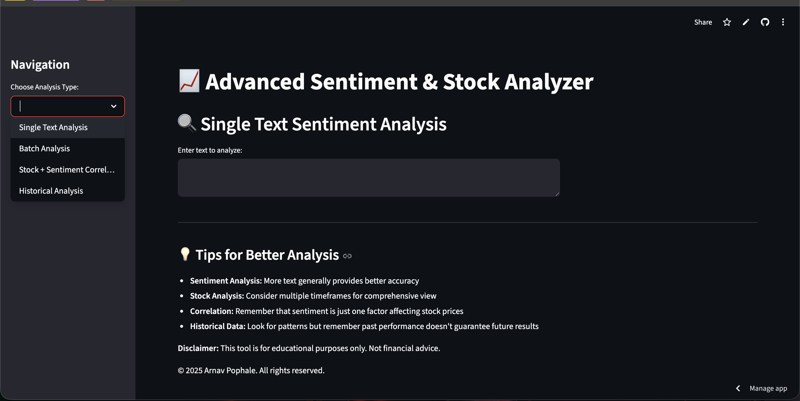
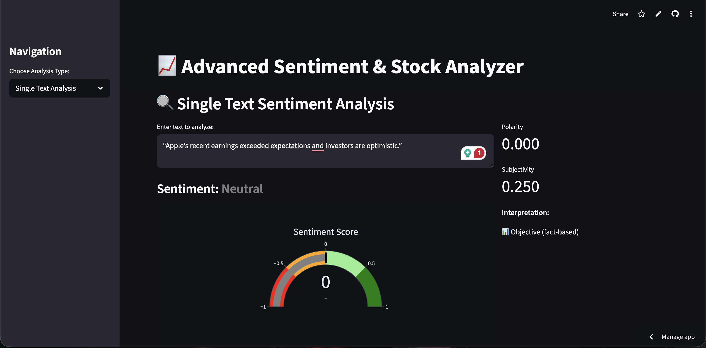

# NeuroStock-Analyzer
# NeuroStock Analyzer — Sentiment & Stock Dashboard




## Overview
NeuroStock Analyzer is an interactive Streamlit web application that combines
natural language sentiment analysis with stock market visualization to explore
how textual sentiment aligns with market behavior.

The project demonstrates an end-to-end data application including data ingestion,
analysis, visualization, and deployment.

Features
- Single-text sentiment analysis with polarity and subjectivity scores
- Batch sentiment analysis with aggregate statistics
- Real-time stock price visualization using candlestick charts
- Volume analysis and historical moving averages
- Comparison between sentiment signals and recent price movement

#Tech Stack
- Python
- Streamlit
- TextBlob
- yfinance
- Pandas
- Plotly
- Matplotlib

Project Motivation:
This project was built to explore the intersection of natural language processing
and financial markets, and to demonstrate the ability to build and deploy a
data-driven application.

Limitations & Future Improvements:
Uses a general-purpose sentiment model; finance-specific NLP models could improve accuracy
Future versions may include live news ingestion and social media sentiment
Potential expansion into predictive modeling and backtesting strategies


Disclaimer:
This project is for educational purposes only and does not constitute financial advice.

## Run Locally
```bash
git clone https://github.com/arnav-pophale/NeuroStock-Analyzer.git
cd NeuroStock-Analyzer
pip install -r requirements.txt
streamlit run app.py
